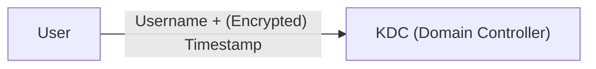
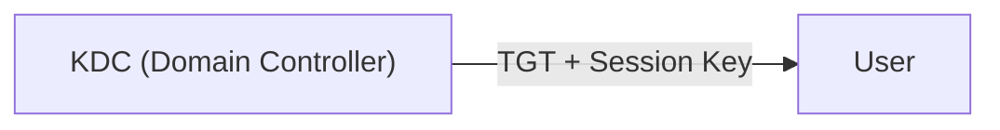
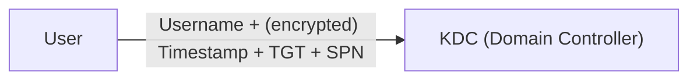
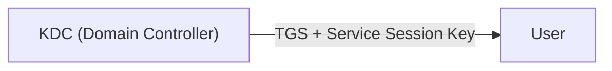
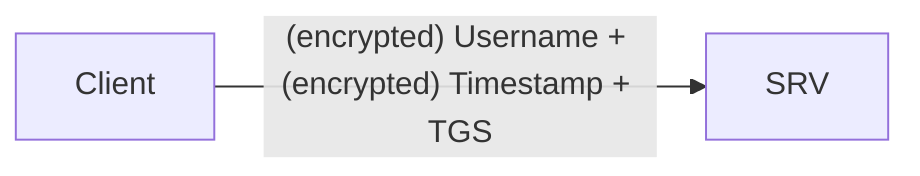
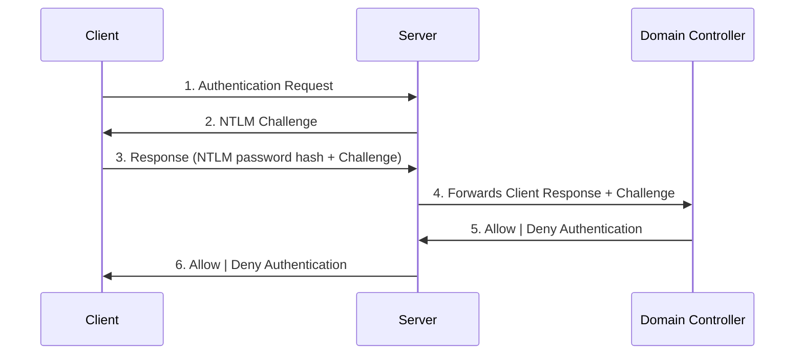
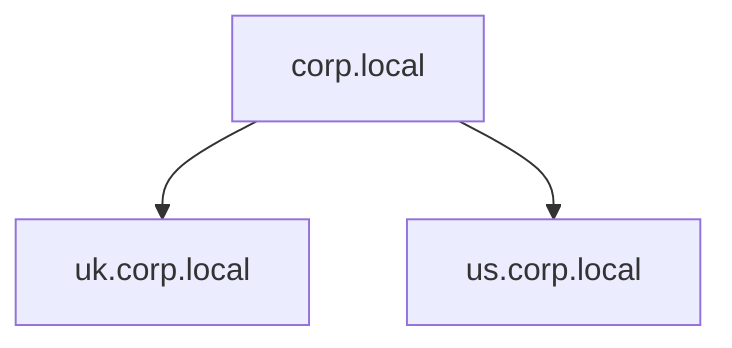
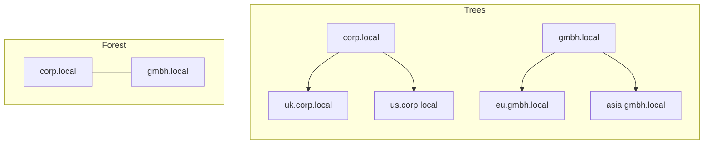

#Windows 
The Active Directory allows easy managment of devices and users within corporate environment.
# Windows Domains
A windows domain is a group of users and machines within a repository called an *Active Directory (AD)*, which allows the centralised administration of components of a Windows computer network. The *Active Directory* runs on a server called the *Domain Controller (DC)*.
The advantages of a Windows domain are:
- **Centralised identity management:** All users across the network can be configured from a *Active Directory*
- **Managing security policies:** configure security policies directly from a *Active Directory* and apply them to users and machines across the network.

**Real World Example**
In school/university networks pupils will often be provided with a username and password, with which they can login into the computers available on the campus. 
When a student logs into a computer his credentials will be send forward to the Active Directory, where the credentials will be checked.  

**Exercise**
# Active Directory
The *Active Directory Domain Service (AD DS)* acts as a catalogue, in which the informations of the objects (user, groups, machines, ...) existing in the network.

**Users**
Users, one of the most common objects, can be assigned to have privileges over *resources*, like files or printer, and are thus called *security principals* (an object that can act upon resources in the network). 
Users can represent two entities:
- **People:** persons, like employees, needing access to the network 
- **Services:** f.e IIS or MSSQL, every service needs an user to run and they have, opposed to a regular user, only the privileges they need to function

**Machines**
Every computer on the network will get a own machine object. They are also considered *security principals*, but have limited rights inside the domain itself. The accounts themselves are local administrators on the assigned computer and are only suppussed to be accessed by the computer itself, but if you have the password you can login. The passwords however consits of 120 random characters and are automatically rotated out.
You can ifentify machine accounts by their naming scheme, which is the computers name followed by a `$`. For example the machine account `DC01$` belongs to the machine named `DC01`. 

**Security Groups**
You can assign accounts to groups, enhancing the manageability by automatically giving the account the groups privileges. As groups can have privilege over resources on the network they are also considered *security principals*.
Groups can have users, machines and other groups as members.

A number of groups are created by default in a domain granting specific privileges to users:

| Group             |                                         Description                                          |
| ----------------- | :------------------------------------------------------------------------------------------: |
| Domain Admins     |      Users have administrative privileges and can administer any computer on the domain      |
| Server Operators  | Users can administer Domain Controllers;cannot change membership of of administrative groups |
| Backup Operator   |        Users can access any file and are used to perform backups of data on computers        |
| Account Operators |                   Users can create and modify other accounts in the domain                   |
| Domain User       |                      Includes all existing users accounts in the domain                      |
| Domain Computers  |         Includes all existing computers in the domain, excluding domain controllers          |
| Domain Contollers |                    Includes all existing domain controllers in the domain                    |
A full list of the default groups can be found in the [Microsoft documentation](https://learn.microsoft.com/en-us/windows-server/identity/ad-ds/manage/understand-security-groups). 

# Configuring Objects using "Active Directory Users and Computers"
To configure objects we need to login to the Domain Controller. 
1. Run "Active Directory Users and Computers" from the start menu.
2. A window will open up where the hierachy of users, computers and groups is shown
3. The objects are organised in container objects called "*Organizational Units (OUs)*" (a user can only be part of a single OU)

There are also default container created automatically by Windows:
- **Builtin:** default groups available to any Windows host
- **Computers:** machines joining the network Will be placed here but can be moved if needed
- **Domain Controllers:** default OU containing the DCs in your network
- **Users:** default users and groups that apply to a domain wide context
- **Managed Service Accoutns:** accounts used by services in your Windows domain

**Security Groups vs. Organizational Units**
- *Organizational Units* are good for applying policies to objects that are based on their role in the enterprise/organisation. Remember a user can only be a member of a single *OU*.
- *Security Groups* are used to grant permission over resources, f.e. a shared folder or network printer. Remember a user can be part of multiple *Security Groups*.

## Managing Users 
This is still using "Active Drirectory Users and Computers"

**Deleting Organizational Units and Users**
1. You need to enable "Advanced Features" in the "View" menu, as *OUs* are by default protected against deletion
2. Right click the container, go to "Properties", then the "Object" tab and disable the protection by unchecking the checkbox

**Delegation**
*Delegation* means giving users some specific privileges to perform advanced tasks on *OUs* without needing a Domain Administrator. An example is allowing the IT support to reset low-level privilege users' passwords.
1. Right-click the *OU* and select "Delegate Control"
2. Enter the name of the user in the new window and click "Check Name"
3. Select the delegated tasks 

**Example: Reseting a Password**
1. We select the "Sales" *OU* and follow the steps above to delegate the privileges to reset passwords of users in this *OU*.
2. We switch to another Computer and use FreeRDP 
```
xfreerdp IP-address
xfreerdp 192.168.1.101
```
3. We log in with Phillip's credentials "phillip:Claire2008"
4. We use *PowerShell* to reset the password of the employee Sophie in the sales *OU*
```
Set-ADAccountPassword sophie -Reset -NewPassword (Read-Host -AsSecureString -Prompt 'New Password') -Verbose
```
5. We enter a new password
6. We force a password reset at the next login
```
Set-ADUser -ChangePasswordAtLogon $true -Identity sophie -Verboseqw
```
7. We can now use FreeRPD again but login with Sophie's username "sophie" and her new password we assigned to her

## Managing Computers
All machines that join a domain are by default added to the "Computers" container. This is not ideal since it is unlikely that all machines have the same policy.
A starting point to segregate the machines is based on their usage:
1.  **Worksations:** The most common device; these devices are used for employees to do their work, so each user will be logging into one, meaning that these devices should not have a privileged user sign into them
2.  **Server:**  The second most common device; used to provide services to other devices
3. **Domain Controller:** Domain Controller allow you to manage the Active Directory and are considered the most sensitive devices within the network as they contain hashed passwords of all user accounts within the environment

**Exercise**
1. We open "Active Directory Users and Computers" and navigate to the computers tab
2. We create two new *OU*, by right-clicking on a parent object and selecting "New > Organisational Unit" called "Worksations" and "Servers"
3. We navigate to the "Computers" tab, select each computer by right-clicking on it and selecting "Move..." and then select the "Workstation" or "Server" *OU*

# Group Policies
Policies and security baselines can be managed with *Group Policiy Objects (GPO)*, which is a collection of settings that can be applied to *OUs*.
To configure *GPOs*, you use the *Group Policy Managment* tool, available from the start menu:
1. Open the *Group Policy Managment* tool
2. After opening it you will see a hierachy of the complete *OU*; create a *GPO* uncer "Group Policy Objects" and apply it to the desired *OU*.  

**Notes**
- A *GPO* will apply to the linked *OU* and all sub-*OUs* under it
- You can apply *Security Filtering* to *GPOs*, so they only apply to speciific users/computers; by default they apply to *Authenticated Users*, which includes all users/PCs
- The "Settings" tab includes the actual contents of the *GPO* and the specific configurations it applies.
- As a *GPO* applies to the whole domain, any change will affect all computers in it
- For more information about policies  double click on them and read the "Explain" tab

**GPO distribution**
*GPOs* are distributed via a network share called `SYSVOL`, stored in the `C:\Windows\SYSVOL\sysvol` directory on each Domain Controller. Every user should have access to this share to sync their *GPOs*.
After changes to a *GPO* is made it can take up to 2 hours for computers to catch up, to force a computer to sync you can enter the following command in powershell on the specific computer:
```
gpupdate /force
``` 

**Example: Changing the Password Length Requirement**

**Example: Creating GPOs**

# Authentication Methods
When a user tries to authenticate to a service using domain credentials, stored in the Domain Controller, the service must ask the Domain Controller to verify if they are correct. 
There are two protocols used for network authentication in Windows Domains:
- *Kerberos*: Used by recent Windows versions and the default in recent domains
- *NetNTLM*: Legacy protocol; kept for compatibility purposes

## Kerberos Authentication
Kerberos uses tickets, which are assigned to a user and act as a form of authentication by presenting it to a service.

The process of Kerberos is:
1. **Requesting a Ticket**
   The user sends their username and a timestamp, encrypted with a key derived form their password, to the *Key Distribution Center (KDC)*, installed on the Domain Controller and responsible for ticket creation.

2. **Response from KDC** 
   The *KDC* creates and responds with a *Ticket Granting Ticket (TGT)*, allowing the user to requset additional tickets to access specific services and circumventing that the vredentials need to be send everytime when connecting to a service, and a *Session Key*, needed to generate the following requests.
   The *TGT* is encrypted with the *krbtgt* accounts password hash, meaning a user can not access the contents, and contains a copy of the *Session Key*, so the *KDC* does not need to store a copy, but decrypt the *TGT* if needed. 

3. **Ticket Granting Service (TGS) Request**
   When the user wants to connect to a service they will use their *TGT* to request a *Ticket Granting Service (TGS)* from the *KDC*. The *TGS* are tickets that allow the connection to specific services they were created for. The users makes the request by sending their username and  a timestamp, encrypted with the *Session Key* as well as the *TGT* amd s *Service Principal Name (SPN)*.

4. **Response from KDC**
   The *KDC* responds with a *TGS* and a *Service Session Key*, which is needed to authenticate to a service. The *TGS* is encrypted with a key that is derived from the *Service Owner Hash*, the user or machine account that runs the service. The *TGS* contains a copy of the *Service Session Key*, so the *Service Owner* can access it by decrypting the *TGS*.

 5. **Authenticate to Server**
    The *TGS* can be sent to the desired service to authenticate and establish a connection. The service uses its configured account's password hash to decrypt the *TGS* and validate the *Service Session Key*.

## NetNTLM Authentication
NetNTLM uses a challenge-response mechanism:
1. The client sends an authentication request to the server they want to access.
2. The server generates a random number and sends it as a challenge to the client.
3. The client combines their *New Technology LAN Manager (NTLM)* password hash with the challenge to generate a response and sends it back.
4. The server forwards the challenge and the response to the Domain Controller for verification.
5. The *Domain Contoller* recalculates uses the challenge to recalculate the response and compares it to the original one. The result is send back to the server.
6. The server forwards the authentication result to the client.


# Trees, Forests and Trust Relationships
**Trees**
You can join multiple domains into a *Tree*, allowing you to partition a network into units that can be managed independently.
**Example: Network expansion in different countries**
A company grows, expands to a new country and their old single domain network is not good enough anymore. This expansion means that there are different laws and regulations in the new country, so you have to update your *GPOs* and new employees have to manage new resources. Instead of creating a complex *OU* with the use of delegation or having a huge *AD* structure. You can split the domain into subdomains and a tree with a root domain on top.

With this configuration the employees in both countries have their own *Domain Controller*, managing only their own resources. That means that the US team can not manage UK user and vise verca.
A new group that comes into place when talking about trees and forests are *Enterprise Admins*, who grant users administrative privileges over all of an enterprise's domain.

**Forests**
When multiple trees with different namespaces are in a union they create a *Forest*. 
This can oocure when a company aquires another company.

**Trust Relationships**
A *Trust Relationship* allows a user of one domain to access resources from another domain, f.e. a user of `us.corp.local` accesses a shared folder on `asia.gmbh.local`.
The simplest form of a *Trust Relationship* is a *one-way Trust Relationship*. If `Domain A` trusts `Domain B`, a user of `Domain B` can access resources on `Domain A`.

There is also a *two-way Trust Relationship*, which should not need an explanation now.
